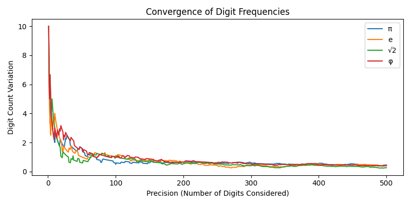
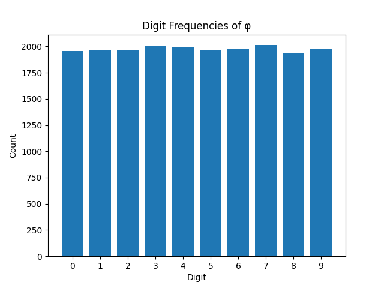
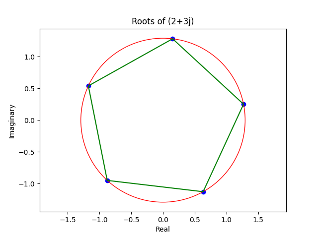
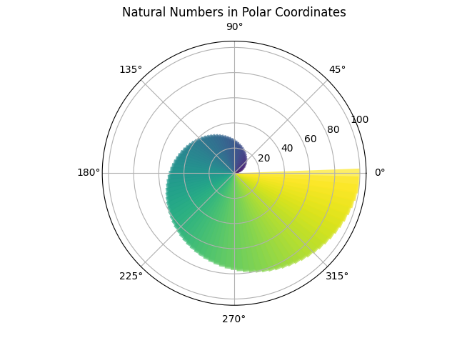

# Math Lab
### A Collection of Mathematical Functions and Visualizations in Python
Welcome to Math Lab! This repository is a fun collection of mathematical functions and visualizations implemented in Python. Whether you're a math enthusiast or simply curious about exploring mathematical concepts, Math Lab provides a range of interactive functions and visualizations to spark your interest.

### Julia Set Visualization
The [Julia set](https://en.wikipedia.org/wiki/Julia_set) is a fractal defined by a complex number c. The set is obtained by iterating the function f(z) = z^2 + c, starting with z = 0. The Julia set is the set of complex numbers c such that the series z_n = f(z_{n-1}) does not tend to infinity. The Julia set is a fractal, meaning that it has a fine structure at arbitrarily small scales. This is a visualization of the Julia set for a given complex number c.


```python
def julia(x, y, c, max_iterations):
    z = complex(x, y)
    for i in range(max_iterations):
        z = z**2 + c
        if abs(z) > 2.0:
            return i
    return 0
```
### All the digits appears the same number of times in the expansion of irrational numbers
Have you ever wondered how the digits of irrational numbers are distributed? The count of digits (0...9) of irational numbers (e.g. pi, e, sqrt(2), etc.) are uniformly distributed. This is a visualization of the difference between the count of digits of two irational numbers.



The amout of time of each digit appears in pi.



### Complex Roots Visualization
Given a complex number, its n-th roots are uniformly distributed on a circle with radius equal to the magnitude of the complex number. This is a visualization of the n-th roots of a complex number.


```python
root_magnitude = np.abs(complex_number) ** (1 / n)
roots = []
for k in range(n):
    angle = np.angle(complex_number)
    root = root_magnitude * (
        np.cos((angle + 2 * np.pi * k) / n) + 1j * np.sin((angle + 2 * np.pi * k) / n)
    )
    roots.append(root)
```
### Natural Numbers
The distribution of the natural numbers in polar coordinates reminds me to the golden ratio.


