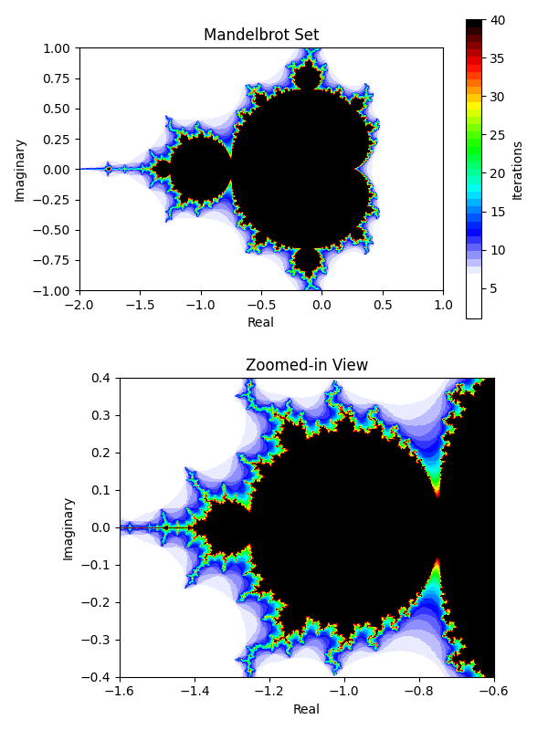

# Math Lab
### Mathematical Functions and Visualizations in Python
Welcome to Math Lab! I hope you enjoy this collection of mathematical functions and visualizations. I will be adding more functions and visualizations in the future. If you have any suggestions, please let me know.

$$e^{i \pi} + 1 = 0$$

$$\frac{1}{\pi} = \frac{2\sqrt{2}}{99^2} \sum_{k=0}^{\infty} \frac{(4k)!}{k!^4} \frac{26390k + 1103}{396^{4k}}$$

$$\int_{-\infty}^{\infty} e^{-x^2} dx = \sqrt{\pi}$$

### Table of Contents
- [Complex Roots](#complex-roots)
- [Mandelbrot Set](#mandelbrot-set)
- [Julia Set](#julia-set)
- [Digit Distribution in Irrational Numbers](#digit-distribution-in-irrational-numbers)
- [Natural Numbers Distribution](#natural-numbers-distribution)

### Complex Roots
Given a complex number $z$, its n-th roots are uniformly distributed on a circle with radius $|z|^{1/n}$ and center at the origin. The roots are equally spaced, and the angle between each root is $2 \pi / n$.


The n-th roots of $z$ can be calculated using the formula:

$$\sqrt[n]{z} = |z| \left( \cos \left( \frac{\phi + 2 \pi k}{n} \right) + i \sin \left( \frac{\phi + 2 \pi k}{n} \right) \right)$$

Where $k = 0, 1, 2, ..., n-1$, and $\phi$ is the argument (angle) of $z$.

```python
root_magnitude = np.abs(complex_number) ** (1 / n)
roots = []
for k in range(n):
    angle = np.angle(complex_number)
    root = root_magnitude * (
        np.cos((angle + 2 * np.pi * k) / n) + 1j * np.sin((angle + 2 * np.pi * k) / n)
    )
    roots.append(root)
```
[Click here to see the complete code](complex_roots.py)

### Mandelbrot Set
The [Mandelbrot set](https://en.wikipedia.org/wiki/Mandelbrot_set) emerges from iteratively evaluating the equation $z_{n+1} = z_n^2 + c$ where $z$ is a complex number and $c$ is a constant. This operation is performed over and over again for each point in the complex plane. If the values of $z$ stay bounded during these iterations, the point is considered part of the Mandelbrot set; if they diverge, it's not.



```python
def mandelbrot(c, max_iterations):
    z = 0
    n = 0
    while abs(z) <= 2 and n < max_iterations:
        z = z**2 + c
        n += 1
    return n
```
[Complete code](fractals.py)

### Julia Set
The [Julia set](https://en.wikipedia.org/wiki/Julia_set) is similar to the Mandelbrot set, but instead of iterating over the complex plane, it iterates over a single point $c$ while the other point $z$ is fixed. The Julia set is the set of points $c$ for which the sequence $z_{n+1} = z_n^2 + c$ does not diverge.


```python
def julia(x, y, c, max_iterations):
    z = complex(x, y)
    for i in range(max_iterations):
        z = z**2 + c
        if abs(z) > 2.0:
            return i
    return 0
```
[Julia set complete code](fractals.py)

### Digit Distribution in Irrational Numbers
Have you ever wondered how the digits of irrational numbers are distributed? Me neither, but when we dive into the realm of infinity, every digit appears to show up an equal number of times!


First 1M digits of pi.


Good luck finding your birthday.

### Natural Numbers Distribution
Plotting the natural numbers on polar coordinates show us this beautiful remarkable pattern. The numbers are distributed in a spiral shape, that reminds me to the [Golden Ratio](https://www.elegantthemes.com/blog/design/the-golden-ratio-the-ultimate-guide-to-understanding-and-using-it). The distance between each number and the origin is equal to its value.


