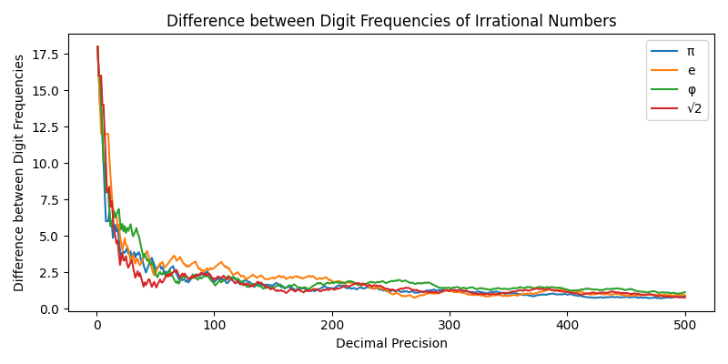
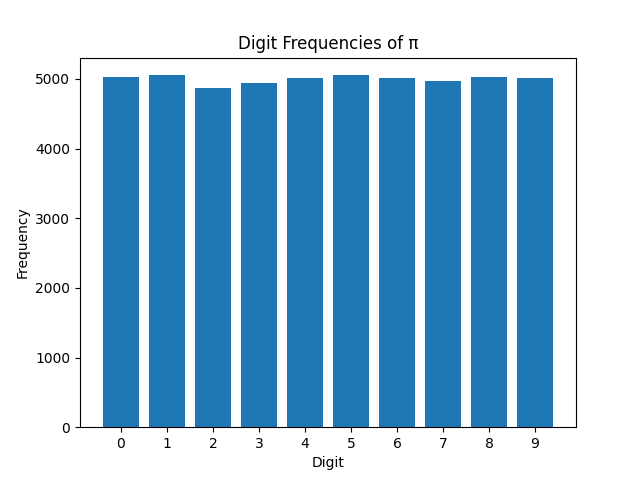

# Math Lab
### Mathematical Functions and Visualizations in Python
Welcome to Math Lab!

### Julia Set
The [Julia set](https://en.wikipedia.org/wiki/Julia_set) is the set of complex numbers c such that the series z<sub>n+1</sub> = z<sub>n</sub><sup>2</sup> + c does not diverge. The Julia set is a fractal, which means that it has a self-similar structure. This is a visualization for different values of c.


```python
def julia(x, y, c, max_iterations):
    z = complex(x, y)
    for i in range(max_iterations):
        z = z**2 + c
        if abs(z) > 2.0:
            return i
    return 0
```
[Julia set complete code](julia.py)

### Distribution of Digits in Irrational Numbers
Have you ever wondered how the digits of irrational numbers are distributed? Me neither, but the count of digits (0 to 9) of irational numbers (pi, e, sqrt(2), etc.) are uniformly distributed. When it comes to infinity, all digits have appeared the same number of times.




First 100000 digits of pi.


Good luck finding your birthday.

### Complex Roots
Given a complex number z, its n-th roots are uniformly distributed on a circle with radius equal to the magnitude of z.


```python
root_magnitude = np.abs(complex_number) ** (1 / n)
roots = []
for k in range(n):
    angle = np.angle(complex_number)
    root = root_magnitude * (
        np.cos((angle + 2 * np.pi * k) / n) + 1j * np.sin((angle + 2 * np.pi * k) / n)
    )
    roots.append(root)
```
[Click here to see complete code](complex_roots.py)

### Natural Numbers Distribution
Plotting the natural numbers (1, 2, 3, ...) on polar coordinates show us this beautiful pattern. The numbers are distributed in a spiral shape, that reminds me to the [Golden ratio](https://www.elegantthemes.com/blog/design/the-golden-ratio-the-ultimate-guide-to-understanding-and-using-it). The distance between each number and the origin is equal to its value.


